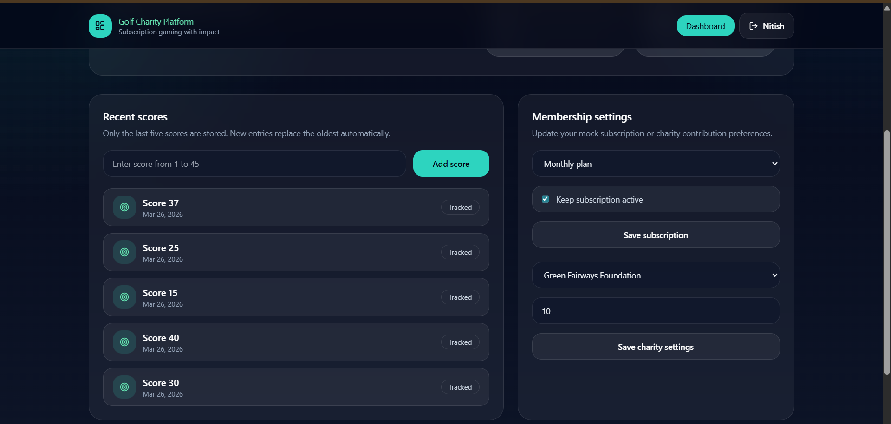
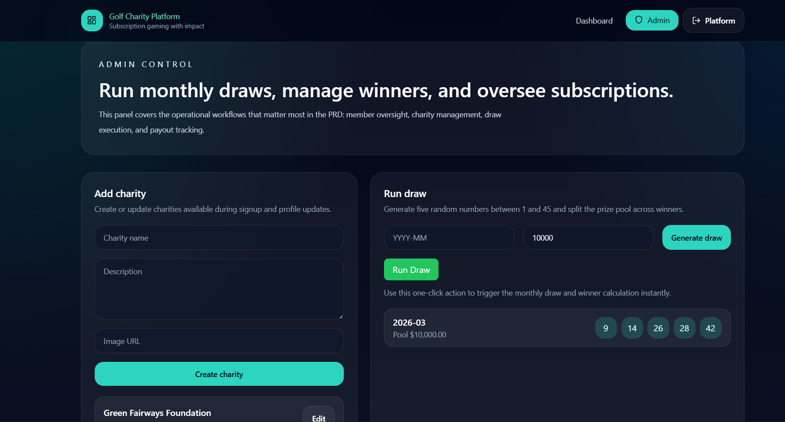

# Golf Charity Subscription Platform

A full-stack MERN application that combines golf scoring, subscription-based rewards, and charitable contributions into a unified platform.

## Live Demo

Frontend (Vercel):
https://golf-charity-subscription-platform-nu.vercel.app

Backend API (Render):
https://golf-charity-backend-pmy5.onrender.com

## Features

Authentication
- User signup and login
- JWT-based authentication
- Secure session handling

Membership System
- Monthly subscription model
- Mock billing activation
- Plan selection and management

Charity Integration
- Select a charity during signup
- Contribution percentage tracking
- Real-time charity data from backend

Golf Score Tracking
- Add scores from 1 to 45
- Stores last 5 scores
- Auto-replacement of oldest entries

Dashboard
- Subscription status
- Tracked scores
- Wins and earnings
- Charity contribution overview

## Tech Stack

Frontend
- React.js (Vite)
- Tailwind CSS
- Axios

Backend
- Node.js
- Express.js
- MongoDB (Mongoose)

Deployment
- Frontend: Vercel
- Backend: Render
- Database: MongoDB Atlas

## Environment Variables

Frontend (`.env`)
```env
VITE_API_URL=https://golf-charity-backend-pmy5.onrender.com
```

Backend (`.env`)
```env
PORT=5000
MONGODB_URI=your_mongodb_connection
JWT_SECRET=your_secret
JWT_EXPIRES_IN=7d
CLIENT_URL=https://golf-charity-subscription-platform-nu.vercel.app
ADMIN_EMAIL=admin@example.com
ADMIN_PASSWORD=admin123
```

## Key Challenges Solved

- Fixed CORS issues between Vercel and Render
- Resolved API route mismatches (`/charities` vs `/api/charities`)
- Handled SPA routing and refresh 404 issues
- Implemented robust API client with URL normalization
- Prevented infinite loading states with timeout handling

## Screens

- Signup with charity selection
- User dashboard with analytics
- Score tracking interface

## Screenshots

### User Dashboard


### Admin Panel


## Future Improvements

- Payment gateway integration (Stripe)
- Real-time leaderboard
- Admin analytics dashboard
- Email notifications
